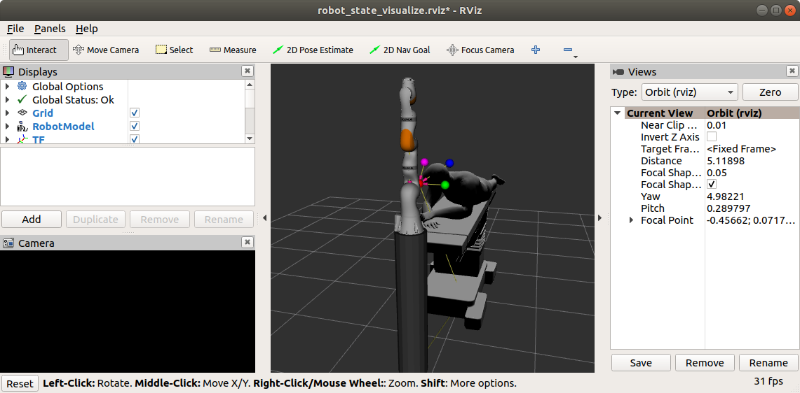

# Visual Servoing lab
This lab was created by Pere Ridao and Narcís Palomeras by the Erasmus Mundus Joint Master Degree MAIA in the University of Girona for the course about Medical Robots.

## Installation
The package has been tested on Ubuntu 18.04 and ROS Melodic but it should work with other ROS flavours.
This package has 2 dependencies that have to be manually installed:
* [https://github.com/ros-industrial/kuka_experimental](https://github.com/ros-industrial/kuka_experimental]):To have the URDF for the kuka manipulator
* [https://github.com/lucasw/rviz_camera_stream](https://github.com/lucasw/rviz_camera_stream): To simulate a camera using only RViz

Clone the 3 packages in your `CATKIN_WORKSPACE` using `$ git clone ...`. Then check that everything is correctly 
installed. To do it execute:

```bash
$ roslaunch visual_servoing visual_servoing.launch
```

An RViz window similar to this one should appears.


If you want to move the arm manually be sure to enable the param
```xml
<param name="use_gui" value="true" />
```
in the file [./launch/visual_servoing.launch](./launch/visual_servoing.launch).

### Exercises
This package will be used to perform a couple of exercises that will be provided to you. 
Follow them to complete the lab.