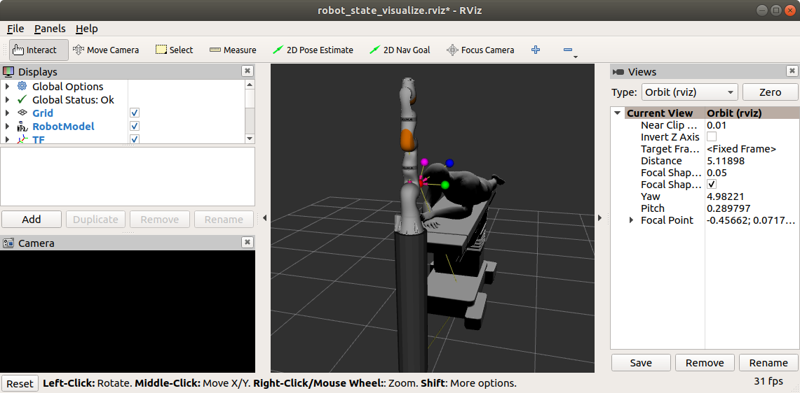

# Visual Servoing lab

## 1. Familiarization with URDF and PyKDL

The Unified Robot Description Format (URDF) has been adopted by the Robot Operative System (ROS) as the format to describe a robot. You can find more information about URDF in:

- [http://wiki.ros.org/urdf](http://wiki.ros.org/urdf)

To see how a very simple robot manipulator can be defined using URDF download the following package:

* [github.com/narcispr/manipulators_description](http://github.com/narcispr/manipulators_description)

Try to understand the URDF for this manipulator and then:

- **Forward kinematics**: Create a script that subscribes to the */joint_states* topic and computes the position of the end effector with respect to the base using the *PyKDL.ChainFkSolverPos_recursive()* method from the PyKDL library. Compare the obtained result with the transformation between the manipulator base and the end effector. To do it, use the ROS 
[TF listener](http://wiki.ros.org/tf/Tutorials/Writing a tf listener (Python)) utility.

Use the following PyKDL methods:

```python
# Initialize
import kdl_parser_py.urdf
import PyKDL
from urdf_parser_py.urdf import URDF

urdf = URDF.from_parameter_server(...)
tree = kdl_parser_py.urdf.treeFromUrdfModel(urdf)
chain = {ef_frame: tree[1].getChain(base_frame, ef_frame)}
fk_pos_solver = PyKDL.ChainFkSolverPos_recursive(chain[ef_frame])
ik_vel_solver = PyKDL.ChainIkSolverVel_pinv(chain[ef_frame])

# Solver forward kinematics position or inverse kinematics velocity
fk_pos_solver.JntToCart(...)
ik_vel_solver.CartToJnt(...)
```

## 2. Visual servoing

To complete the exercises proposed in parts 2.1 and 2.2, you need to install first the `visual_servoing` ROS package that you can find at [https://github.com/narcispr/visual_servoing](https://github.com/narcispr/visual_servoing).
Follow the instructions on this package to ensure that everything is correctly installed.

If everything is ok, you will be able to see an scene in RViz like the one here.



You can see a Kuka medical robot and a patient with four color markers in the head.

### 2.1 Blob detector

Create a node named `blob_detector` that subscribes to the `/camera2/image` topic, segments the image by color (HSV) and publishes the position (in pixels) of each blob (*blob_red*, *blob_blue*, *blob_green* and *blob_magenta*) using a `geometry_msgs/PointStamped` where the `header.frame_id` has to match with the blob name.

*Example:*

```json
header: 
  seq: 78
  stamp: 
    secs: 1568818287
    nsecs: 838789939
  frame_id: "blob_magenta"
point: 
  x: 607.0
  y: 330.0
  z: 0.0
```

### 2.2 Visual servoing controller

Once you know the position of each feature in the image you can use the image Jacobian to relate the features motion $(\dot{\bar{u}}, \dot{\bar{v}})$  with the camera motion $v= (v_x, v_y, v_x, w_x, w_y, w_z)^T$:

$$
v = \left( \begin{array}{c}
J_1 \\ 
\vdots\\
J_N 
\end{array}\right)^ + \lambda (p_{desired} - p_{current})
$$
with $\lambda$ being a constant gain, $p_desired$ the desired position for each feature in the image, $p_current$ the current position of each feature in the image, and
$$
{J_p} =
\left( \begin{array}{cccccc}
-\frac{f}{\rho_uZ}& 0 & \frac{\bar{u}}{Z} & \frac{\rho_u \bar{u}\bar{v}}{f} & -\frac{f^2 + \rho_u^2 \bar{u}^2}{\rho_u f} & \bar{v}\\
0 & -\frac{f}{\rho_vZ} & \frac{\bar{v}}{Z} & \frac{f^2 + \rho_v^2 \bar{v}^2}{\rho_v f} & -\frac{\rho_v \bar{u}\bar{v}}{f} & -\bar{u}
\end{array}\right)
$$


were, $f$ is the focal length, $\rho_u$ and $\rho_v$ is the pixel size in $u$ and $v$, $Z$ is the distance to the features (you can use a constant value around 0.5) and ($\bar{u},\bar{v}$) is the feature position in the image with respect to the center point ($u_0, v_0$). 

Using the *PyKDL.ChainIkSolverVel_pinv()* method transform this camera motion into a velocity for each joint. Take into account that $v$ is a velocity in the camera frame while the *IkSolverVel* needs a velocity referenced in the manipulator base.

Create a node called `visual_servoing` that loads the manipulator URDF from the parameter `robot_description` (in the param server) and initialize the inverse kinematics velocity solver. Using the previous equations compute the desired position for each joint and publish it at 10Hz. 

The goal is to drive the camera from the starting position (in which the four markers are visible by the camera) into a position where the four blobs are in the center of the image and each one at 200px distance.


In summary, the steps that you have to do are:

* Compute the desired velocity for each marker in the image plane.
* Obtain the camera velocity using the previous equations
* Transform the camera velocity from the camera frame to the manipulator base frame
* Use the inverse kinematics velocity solver to find the velocity for each joint in order to achieve the velocity for the camera

 ## 3. Deliverable

The three scripts `forward_kinematics_check.py`, `blob_detector.py` and  `visual_servoing.py` has to be delivered. Note that I'll run them with a fresh `manipulators_description` and `visual_servoing` packages and they have to work. Moreover, write an **INDIVIDUAL** report **no longer than 4 pages**. Indicate in the report the name of your partner if the code has not been done individually.